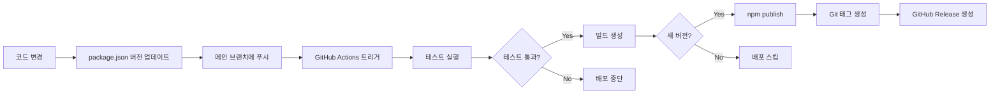

# 자동 배포 설정 가이드

이 문서는 메인 브랜치에 푸시 시 자동으로 npm에 패키지를 배포하는 설정을 안내합니다.

## 🚀 설정된 워크플로우

### 1. **CI Workflow** (`.github/workflows/ci.yml`)

- **트리거**: Pull Request 생성 또는 메인 브랜치 외의 브랜치에 푸시
- **목적**: 코드 품질 검증
- **작업**:
  - 린터 실행
  - 테스트 실행 (Node.js 16, 18, 20)
  - 빌드 검증
  - 패키지 배포 가능 여부 확인

### 2. **Publish Workflow** (`.github/workflows/publish.yml`)

- **트리거**: 메인 브랜치에 푸시
- **목적**: npm 자동 배포
- **작업**:
  - 테스트 실행
  - 빌드 생성
  - 버전 확인 (이미 배포된 버전인지 체크)
  - npm에 배포
  - Git 태그 생성
  - GitHub Release 생성

## 🔧 필수 설정

### NPM Token 설정

1. **NPM 토큰 생성**

   ```bash
   # npmjs.com에 로그인
   npm login

   # Access Token 생성 (https://www.npmjs.com/settings/YOUR_USERNAME/tokens)
   # Type: Automation
   # 생성된 토큰 복사
   ```

2. **GitHub Secrets 설정**
   - GitHub 저장소로 이동
   - `Settings` → `Secrets and variables` → `Actions`
   - `New repository secret` 클릭
   - Name: `NPM_TOKEN`
   - Value: 복사한 npm 토큰 붙여넣기
   - `Add secret` 클릭

## 📦 배포 프로세스

### 자동 배포 워크플로우



### 버전 업데이트 및 배포 방법

1. **로컬에서 버전 업데이트**

   ```bash
   # 패치 버전 업데이트 (2.5.2 → 2.5.3)
   npm version patch

   # 마이너 버전 업데이트 (2.5.2 → 2.6.0)
   npm version minor

   # 메이저 버전 업데이트 (2.5.2 → 3.0.0)
   npm version major

   # 또는 특정 버전으로 직접 설정
   npm version 2.6.0
   ```

2. **메인 브랜치에 푸시**

   ```bash
   git push origin main
   ```

3. **GitHub Actions가 자동으로**:
   - 테스트 실행
   - 빌드 생성
   - npm에 배포
   - v2.6.0 같은 Git 태그 생성
   - GitHub Release 생성

## ⚠️ 중요 사항

### 버전 관리

- 같은 버전은 중복 배포되지 않습니다
- `package.json`의 버전이 npm에 이미 존재하면 배포를 건너뜁니다
- 항상 `npm version` 명령어를 사용하여 버전을 올리세요

### 배포 전 체크리스트

- [ ] `CHANGELOG.md` 업데이트
- [ ] 모든 테스트 통과 확인
- [ ] 빌드 에러 없음 확인
- [ ] `package.json` 버전 업데이트
- [ ] `README.md` 필요 시 업데이트

## 🔍 트러블슈팅

### 배포가 실행되지 않는 경우

1. NPM_TOKEN이 올바르게 설정되었는지 확인
2. package.json의 버전이 이미 배포된 버전인지 확인
3. GitHub Actions 로그에서 에러 확인

### 배포는 되었지만 태그가 생성되지 않은 경우

1. GitHub Actions에 GITHUB_TOKEN 권한이 있는지 확인
2. Repository Settings → Actions → General → Workflow permissions 확인

### 수동 배포가 필요한 경우

```bash
# 로컬에서 수동 배포
cd packages/i18nexus
npm run build
npm publish --access public
```

## 📚 관련 문서

- [GitHub Actions 문서](https://docs.github.com/en/actions)
- [npm publish 문서](https://docs.npmjs.com/cli/v9/commands/npm-publish)
- [Semantic Versioning](https://semver.org/)
